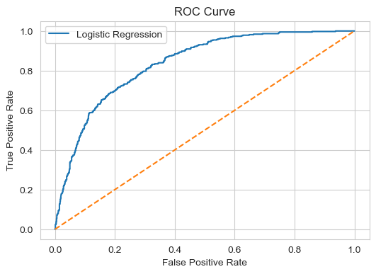
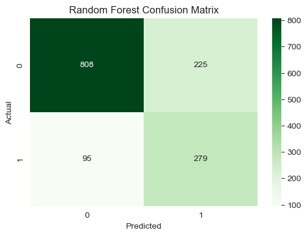
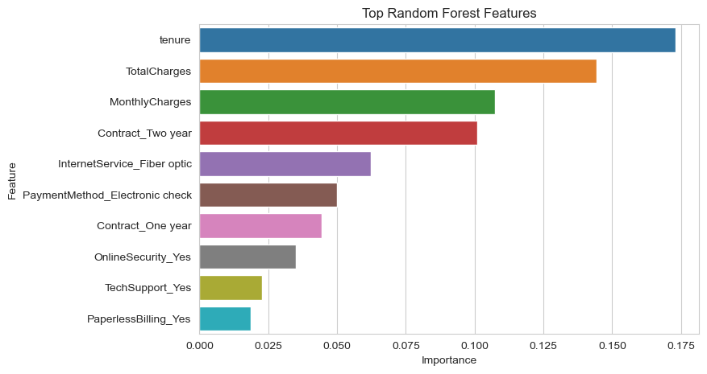

# Customer Churn Prediction using Machine Learning

##  Project Overview

This project focuses on predicting customer churn for a telecom company using Machine Learning techniques.

Customer churn prediction helps businesses identify customers who are likely to leave the service, allowing companies to take proactive retention actions and reduce revenue loss.

The project includes:
- Data Cleaning
- Exploratory Data Analysis (EDA)
- Data Preprocessing
- Feature Engineering
- Machine Learning Modeling
- Model Evaluation
- Feature Importance Analysis
- Business Insights & Recommendations

---

#  Dataset Information

The dataset contains telecom customer information such as:
- demographic details
- subscription services
- billing information
- contract details
- churn status

Target Variable:
- `Churn`
    - Yes → Customer left the company
    - No → Customer stayed

---

#  Technologies Used

- Python
- NumPy
- Pandas
- Matplotlib
- Seaborn
- Scikit-learn
- Jupyter Notebook

---

#  Machine Learning Workflow

The project follows a complete end-to-end ML workflow:

1. Data Loading
2. Data Cleaning
3. Exploratory Data Analysis
4. Handling Missing Values
5. Feature Encoding
6. Feature Scaling
7. Train-Test Split
8. Pipeline Creation
9. Logistic Regression
10. Balanced Logistic Regression
11. Random Forest Classifier
12. Model Evaluation
13. Feature Importance Analysis
14. Business Recommendations

---

#  Exploratory Data Analysis

EDA was performed to understand:
- customer behavior
- churn distribution
- pricing patterns
- tenure trends
- contract impact on churn

---

# 🤖 Models Used

## 1. Logistic Regression
Used as a baseline classification model for churn prediction.

## 2. Balanced Logistic Regression
Implemented using:
```python
class_weight='balanced'
```

This improved churn recall for the minority class.

## 3. Random Forest Classifier
Used to capture complex non-linear customer behavior patterns and improve prediction performance.

---

#  Model Evaluation Metrics

The following evaluation metrics were used:

- Accuracy
- Precision
- Recall
- F1-Score
- ROC-AUC Score
- Confusion Matrix

---

#  ROC Curve



---

#  Random Forest Confusion Matrix



---

#  Random Forest Feature Importance



---

#  Key Insights

## Features Increasing Churn Risk
- Fiber optic internet service
- High monthly charges
- Electronic check payment method
- Month-to-month contracts

## Features Reducing Churn Risk
- Longer customer tenure
- One-year and two-year contracts
- Online security services
- Tech support services

---

#  Business Recommendations

Based on the analysis, telecom companies can reduce churn by:

- Encouraging long-term contracts
- Improving customer support services
- Monitoring high-charge customers
- Identifying high-risk customers proactively
- Creating targeted retention campaigns

---

#  Final Model Selection

The **Random Forest Classifier** provided the best overall balance between:
- recall
- precision
- accuracy
- churn detection capability

---

#  Project Structure

```text
telecom-customer-churn-prediction/
│
├── Tele-Customer-Churn-Prediction.ipynb
├── CustomerChurn.csv
├── requirements.txt
├── README.md
│
└── images/
    ├── roc_curve.png
    ├── random_forest_confusion_matrix.png
    └── random_forest_feature_importance.png
```

---

#  How to Run the Project

1. Clone the repository

```bash
git clone <repository-link>
```

2. Install dependencies

```bash
pip install -r requirements.txt
```

3. Open Jupyter Notebook

```bash
jupyter notebook
```

4. Run:
```text
Tele-Customer-Churn-Prediction.ipynb
```

---

#  Conclusion

This project demonstrates how machine learning can help telecom businesses proactively identify high-risk customers and improve customer retention strategies through data-driven decision-making.

The project also highlights:
- proper preprocessing
- avoiding data leakage
- handling class imbalance
- business-oriented model evaluation
- feature importance interpretation

---

#  Author

Shaswat Krishna
